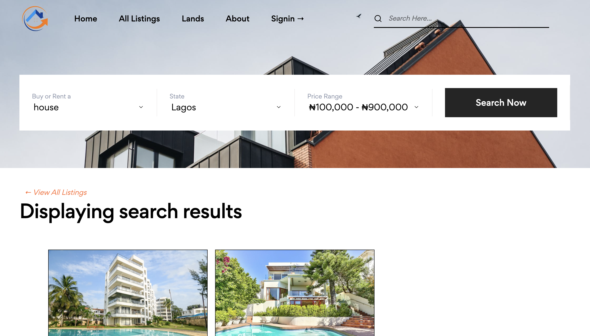

# Prexlyn Properties

A comprehensive real estate listing platform



## Features
1. Create, Read, Update, and Delete Property Listings
2. User Authentication
3. Full search functionality
4. Customized Admin Dashboard

## Technology Stack
- Python
- Django
- PostgreSQL
- JavaScript
- HTML
- CSS

## Project Files Description

### Directories
- accounts: Authentication app
- listings: Listings app
- media: - Media uploads from the database
- pages: control views for `index`, `about`, and `contact` pages.
- prexlyn: contains `static` files and contains URL patterns for `accounts`, `listings`, and `admin` views
- realtors: Realtors app
- static: contains migrated `static` files from `prexlyn` directory for deployment purposes
- templates: HTML templates and partials

### Files
- manage.py: Command Line Utility that manages this django project
- requirements.txt: All installed python packages

## Running the App Locally
### Clone this repository
```
git clone <repository_url>
cd <repository_url>
```

### Install Poetry
```
brew install pipx
pipx ensurepath
pipx install poetry
```

### Activate Virtual Environment
```
poetry shell
```

### Deactivate Virtual Environment
```
exit
```

### Apply Migrations
```
python manage.py makemigrations

python manage.py migrate
```

### Run Development Server
```
python manage.py runserver
```

### Accessing Development Server
Navigate to your web browser and enter the following URL: `http://127.0.0.1:8000/`

### Accessing Admin Dashboard
Navigate to your web browser and enter the following URL: `http://127.0.0.1:8000/admin`

Now, you should have the project up and running locally. Feel free to explore and make any necessary adjustments based on your requirements.

## Visual WalkThrough
Play the video demo below to enjoy a visual walkthrough of the app's features.

[](https://www.youtube.com/watch?v=nhXdaz2eHGY)
